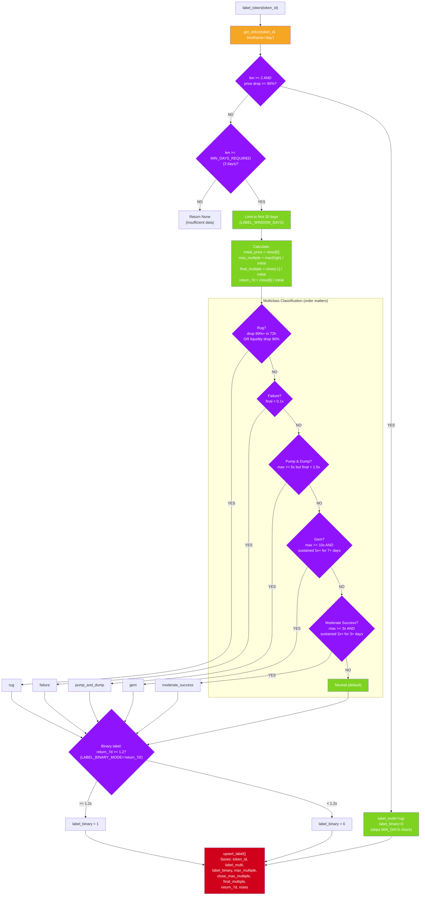
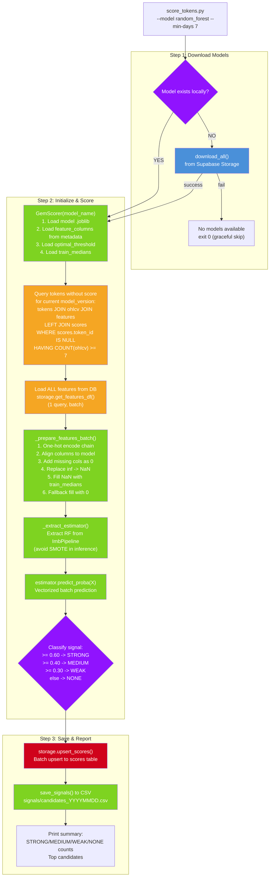
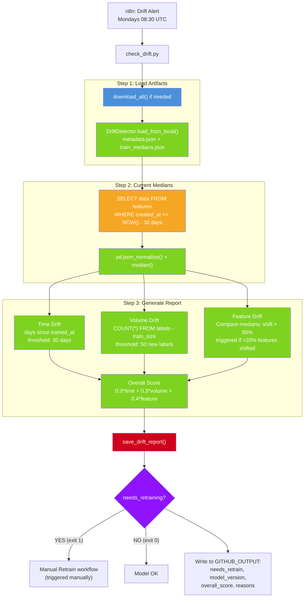
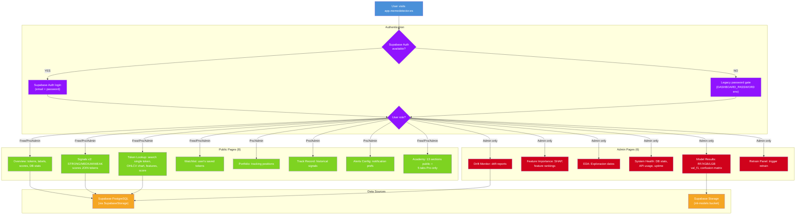
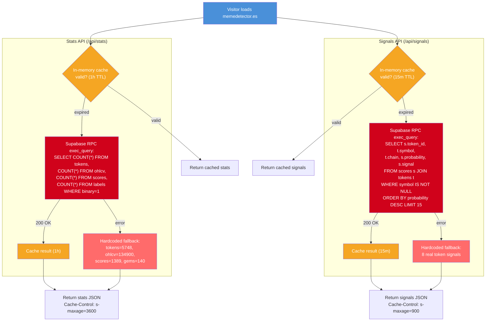

# Trading Memes - System Flowchart (Definitive Map)

> Generated from actual source code. Every node, table, and data path verified against the codebase.

---

## FLOW 1: Daily Collection Pipeline

**Trigger**: GitHub Actions cron (4x/day: 00:00, 06:00, 12:00, 18:00 UTC) or `workflow_dispatch`
**File**: `.github/workflows/daily-collect.yml` -> `src/data/collector.py`
**Timeout**: 120 min total job
**Concurrency group**: `database-writes` (no cancel-in-progress)

```mermaid
flowchart TD
    classDef api fill:#4a90d9,color:white
    classDef db_read fill:#f5a623,color:white
    classDef db_write fill:#d0021b,color:white
    classDef process fill:#7ed321,color:white
    classDef decision fill:#9013fe,color:white
    classDef error fill:#ff6b6b,color:white

    CRON["fa:fa-clock GitHub Actions Cron<br/>4x/day: 00, 06, 12, 18 UTC"]
    SETUP["Setup Python 3.13<br/>pip install, mkdir data/"]

    CRON --> SETUP
    SETUP --> STEP1

    subgraph "Step 1: Discovery (~600 tokens/run)"
        STEP1["1A: GeckoTerminal<br/>discover_new_pools()"]:::api
        STEP1B["1B: DexScreener<br/>discover_from_dexscreener()"]:::api
        STEP1C["1C: CoinGecko Categories<br/>discover_from_coingecko_categories()"]:::api
        STEP1D["1D: Birdeye Discovery<br/>discover_from_birdeye()"]:::api
        DEDUP["Deduplicate by token_id"]:::process
        UPSERT_TOK["upsert_token() per token"]:::db_write
    end

    STEP1 -->|"3 chains x 10 pages x ~20 pools<br/>= ~600 tokens, 0.3s/page"| UPSERT_TOK
    STEP1B -->|"boosted + profiles + CTOs<br/>3 API calls"| UPSERT_TOK
    STEP1C -->|"2 categories x 250/page<br/>2s pause between"| UPSERT_TOK
    STEP1D -->|"3 chains x (new_listings + meme_list)<br/>= 6 API calls"| UPSERT_TOK
    UPSERT_TOK --> DEDUP

    subgraph "Step 2: DexScreener Enrichment"
        STEP2["enrich_with_dexscreener()<br/>get_token_pairs() per token"]:::api
        SNAP_WRITE["insert_pool_snapshot()"]:::db_write
    end

    DEDUP -->|"all unique tokens"| STEP2
    STEP2 -->|"0.2s/token, buyers_24h,<br/>sellers_24h, liquidity, volume"| SNAP_WRITE

    subgraph "Step 3: OHLCV Collection (30 candles/token)"
        STEP3_BIRDEYE["Birdeye OHLCV<br/>get_token_ohlcv() PRIMARY"]:::api
        STEP3_GECKO["GeckoTerminal OHLCV<br/>get_pool_ohlcv() FALLBACK"]:::api
        OHLCV_WRITE["insert_ohlcv_batch()"]:::db_write
    end

    SNAP_WRITE --> STEP3_BIRDEYE
    STEP3_BIRDEYE -->|"900 calls/min<br/>0.15s/token"| OHLCV_WRITE
    STEP3_BIRDEYE -->|"fail"| STEP3_GECKO
    STEP3_GECKO -->|"30 calls/min<br/>needs pool_address"| OHLCV_WRITE

    subgraph "Step 4: Holders (Solana only)"
        STEP4["collect_holders()<br/>Helius RPC: get_token_largest_accounts()"]:::api
        HOLDER_WRITE["insert_holder_snapshot()<br/>top 20 per token"]:::db_write
    end

    OHLCV_WRITE --> STEP4
    STEP4 -->|"only chain=solana<br/>0.3s/token"| HOLDER_WRITE

    subgraph "Step 5: Contract Verification"
        STEP5_ETH["Etherscan V2<br/>is_contract_verified() + get_contract_source()"]:::api
        STEP5_SOL["Solana RPC<br/>get_token_supply()"]:::api
        CONTRACT_WRITE["upsert_contract_info()"]:::db_write
    end

    HOLDER_WRITE --> STEP5_ETH
    HOLDER_WRITE --> STEP5_SOL
    STEP5_ETH -->|"ETH/Base tokens<br/>0.5s/token"| CONTRACT_WRITE
    STEP5_SOL -->|"Solana tokens"| CONTRACT_WRITE

    subgraph "Step 6: Update Existing OHLCV"
        STEP6["update_existing_ohlcv()<br/>max 500 tokens, 14 candles each"]:::process
        STEP6_QUERY["Query tokens with stale OHLCV<br/>ORDER BY ohlcv_count ASC"]:::db_read
        STEP6_BIRDEYE["Birdeye/GeckoTerminal"]:::api
        STEP6_WRITE["insert_ohlcv_batch()"]:::db_write
    end

    CONTRACT_WRITE --> STEP6_QUERY
    STEP6_QUERY --> STEP6
    STEP6 --> STEP6_BIRDEYE
    STEP6_BIRDEYE --> STEP6_WRITE

    subgraph "Post-Collection Steps (in GH Actions YAML)"
        FEAT_EXTRACT["Extract Features<br/>max 500 tokens without features<br/>timeout: 45 min"]:::process
        LABEL_STEP["Label Tokens<br/>label_all_tokens()<br/>timeout: 10 min"]:::process
        BACKFILL["Birdeye Backfill<br/>backfill_ohlcv.py --max-tokens 500<br/>timeout: 30 min"]:::process
        SCORE_STEP["Score Tokens<br/>score_tokens.py --model random_forest<br/>--min-days 7"]:::process
    end

    STEP6_WRITE --> FEAT_EXTRACT
    FEAT_EXTRACT --> LABEL_STEP
    LABEL_STEP --> BACKFILL
    BACKFILL --> SCORE_STEP

    FAIL_NOTIFY["Telegram Alert on Failure"]:::error
    SCORE_STEP -->|"failure()"| FAIL_NOTIFY
```

### Step-by-step detail:

| Step | Function | APIs Hit | DB Writes | Items | Rate Limit | Est. Time |
|------|----------|----------|-----------|-------|------------|-----------|
| 1A | `discover_new_pools()` | GeckoTerminal (30/min) | `tokens` upsert | ~600 (3 chains x 10 pg x 20) | 30/min | ~10 min |
| 1B | `discover_from_dexscreener()` | DexScreener (300/min) | `tokens` upsert | ~50-150 | 300/min | ~5 sec |
| 1C | `discover_from_coingecko_categories()` | CoinGecko (30/min) | `tokens` upsert | ~500 (2 categories) | 30/min | ~10 sec |
| 1D | `discover_from_birdeye()` | Birdeye (900/min) | `tokens` upsert | ~300 (3 chains x 2 endpoints) | 900/min | ~5 sec |
| 2 | `enrich_with_dexscreener()` | DexScreener (300/min) | `pool_snapshots` insert | all discovered | 300/min, 0.2s/tok | ~5 min |
| 3 | `collect_ohlcv()` | Birdeye (primary) / GeckoTerminal (fallback) | `ohlcv` batch insert | all discovered | 900/min | ~5 min |
| 4 | `collect_holders()` | Helius RPC (1000/min) | `holder_snapshots` insert | Solana only | 0.3s/tok | ~3 min |
| 5 | `collect_contract_info()` | Etherscan V2 / Solana RPC | `contract_info` upsert | all discovered | 0.5s/tok | ~5 min |
| 6 | `update_existing_ohlcv()` | Birdeye/GeckoTerminal | `ohlcv` batch insert | max 500 stale | 0.15s/tok | ~2 min |
| YML: Features | `FeatureBuilder.build_features_for_token()` | None (DB only) | `features` save | max 500 new | N/A | ~30 min |
| YML: Labels | `Labeler.label_all_tokens()` | None (DB only) | `labels` upsert | all tokens | N/A | ~5 min |
| YML: Backfill | `backfill_ohlcv.py` | Birdeye (900/min) | `ohlcv` batch insert | max 500 w/<7 candles | 900/min | ~10 min |
| YML: Score | `score_tokens.py` | None (model inference) | `scores` upsert | tokens w/features+7d OHLCV | N/A | ~5 min |

### Error handling per step:
- Each step catches exceptions per-token (`try/except` inside loop), failing tokens are logged and skipped.
- `time.sleep()` between tokens (0.1-0.5s) respects rate limits.
- If the entire job fails, Telegram notification is sent via `failure()` condition.
- The `concurrency: database-writes` group prevents parallel workflow runs.

### Data loss points:
1. **Tokens without pool_address** skip GeckoTerminal OHLCV (mitigated by Birdeye).
2. **Birdeye unavailable** (no API key) = only GeckoTerminal OHLCV (30 calls/min bottleneck).
3. **Holders only for Solana** -- ETH/Base tokens have no holder data.
4. **Feature extraction capped at 500/run** -- new tokens accumulate if discovery rate > 500/6h.
5. **Backfill capped at 500/run** -- tokens with <7 candles accumulate.

---

## FLOW 2: Feature Extraction

**File**: `src/features/builder.py` orchestrates 12 feature modules.
**Entry**: `FeatureBuilder.build_features_for_token(token_id)`

```mermaid
flowchart TD
    classDef db_read fill:#f5a623,color:white
    classDef module fill:#4a90d9,color:white
    classDef output fill:#7ed321,color:white

    INPUT["token_id"]
    TOKEN_Q["Query tokens table"]:::db_read
    TOKEN_Q --> CHAIN["Extract: chain, dex, created_at"]

    INPUT --> TOKEN_Q

    subgraph "Module 1: Tokenomics (6 features)"
        M1_READ["holder_snapshots<br/>(latest snapshot)"]:::db_read
        M1_CONTRACT["contract_info"]:::db_read
        M1["compute_tokenomics_features()"]:::module
    end

    CHAIN --> M1_READ --> M1
    CHAIN --> M1_CONTRACT --> M1

    subgraph "Module 2: Whale Movement (3 features)"
        M2_READ["holder_snapshots<br/>(ALL snapshots)"]:::db_read
        M2["compute_whale_movement_features()"]:::module
    end

    CHAIN --> M2_READ --> M2

    subgraph "Module 3: Liquidity (7 features)"
        M3_READ["pool_snapshots<br/>ORDER BY snapshot_time"]:::db_read
        M3["compute_liquidity_features()"]:::module
    end

    CHAIN --> M3_READ --> M3

    subgraph "Module 4: OHLCV Fetch (shared)"
        M4_READ["ohlcv (hour, fallback day)"]:::db_read
    end

    CHAIN --> M4_READ

    subgraph "Module 4a: Price Action (16 features)"
        M4A["compute_price_action_features()"]:::module
    end
    M4_READ --> M4A

    subgraph "Module 5: Social (7 features)"
        M5_READ["pool_snapshots<br/>(latest snapshot)"]:::db_read
        M5["compute_social_features()"]:::module
    end
    CHAIN --> M5_READ --> M5

    subgraph "Module 5b: Temporal Social (5 features)"
        M5B["compute_temporal_social_features()"]:::module
    end
    M3_READ --> M5B

    subgraph "Module 6: Contract (3 features)"
        M6["compute_contract_features()"]:::module
    end
    M1_CONTRACT --> M6

    subgraph "Module 6b: Contract Risk (EVM only)"
        M6B["compute_contract_risk_features()<br/>only if chain in (ethereum, base)<br/>and is_verified=True"]:::module
    end
    M1_CONTRACT --> M6B

    subgraph "Module 7: Market Context (6 features)"
        M7_CACHE["BTC/ETH/SOL prices<br/>(cached across tokens)<br/>ohlcv WHERE token_id='__btc__'"]:::db_read
        M7["compute_market_context_features()"]:::module
    end
    CHAIN --> M7_CACHE --> M7

    subgraph "Module 8: Temporal (5 features)"
        M8["extract_temporal_features()"]:::module
    end
    CHAIN --> M8

    subgraph "Module 9: Volatility Advanced (11 features)"
        M9["compute_volatility_advanced_features()"]:::module
    end
    M4_READ --> M9

    subgraph "Module 10: Sentiment (6 features, mostly None)"
        M10_API["TwitterClient.get_mention_count()<br/>(requires X_BEARER_TOKEN)"]:::module
        M10["compute_sentiment_features()"]:::module
    end
    CHAIN --> M10_API --> M10

    subgraph "Module 11: Technical (11 features)"
        M11["extract_technical_features()"]:::module
    end
    M4_READ --> M11

    subgraph "Module 12: Interactions (8 features, LAST)"
        M12["extract_interaction_features()<br/>depends on ALL prior modules"]:::module
    end

    M1 --> ACCUM["all_features dict"]:::output
    M2 --> ACCUM
    M3 --> ACCUM
    M4A --> ACCUM
    M5 --> ACCUM
    M5B --> ACCUM
    M6 --> ACCUM
    M6B --> ACCUM
    M7 --> ACCUM
    M8 --> ACCUM
    M9 --> ACCUM
    M10 --> ACCUM
    M11 --> ACCUM
    ACCUM --> M12 --> FINAL["~94 features total"]:::output
```

### Feature Module Inventory:

| # | Module | File | Features | DB Tables Read | NaN Rate |
|---|--------|------|----------|----------------|----------|
| 1 | Tokenomics | `tokenomics.py` | top1_holder_pct, top5_holder_pct, top10_holder_pct, holder_herfindahl, has_mint_authority, total_supply_log | holder_snapshots, contract_info | High for ETH/Base (no holders) |
| 2 | Whale Movement | `tokenomics.py` | whale_accumulation_7d, whale_turnover_rate, new_whale_count | holder_snapshots (all) | High for ETH/Base |
| 3 | Liquidity | `liquidity.py` | initial_liquidity_usd, liquidity_growth_24h, liquidity_growth_7d, liq_to_mcap_ratio, volume_to_liq_ratio_24h, liquidity_stability, liquidity_to_fdv_ratio | pool_snapshots | Medium (~30% tokens lack snapshots) |
| 4 | Price Action | `price_action.py` | return_24h, return_48h, return_30d, max_return_7d, drawdown_from_peak_7d, volatility_24h, volatility_7d, volume_spike_ratio, green_candle_ratio_24h, first_hour_return, volume_trend_slope, volume_concentration_ratio, price_recovery_ratio, volume_sustainability_3d, close_to_high_ratio_7d, up_days_ratio_7d, volume_price_divergence | ohlcv | Low (most have OHLCV) |
| 5 | Social | `social.py` | buyers_24h, sellers_24h, buyer_seller_ratio_24h, makers_24h, tx_count_24h, avg_tx_size_usd, is_boosted | pool_snapshots (latest) | Medium |
| 5b | Temporal Social | `social.py` | buyer_growth_rate, seller_growth_rate, buyer_seller_ratio_trend, volume_consistency, tx_acceleration | pool_snapshots (all) | Medium-High (needs 2+ snapshots) |
| 6 | Contract | `contract.py` | is_verified, is_renounced, contract_age_hours | contract_info | Medium |
| 6b | Contract Risk | `contract.py` | (EVM-only: source analysis) | contract_info | Very High (only verified EVM) |
| 7 | Market Context | `market_context.py` | btc_return_7d_at_launch, eth_return_7d_at_launch, sol_return_7d_at_launch, launch_day_of_week, launch_hour_utc, chain | ohlcv (__btc__, __eth__, __sol__) | Low (market data always available) |
| 8 | Temporal | `temporal.py` | launch_day_of_week, launch_hour_utc, launch_is_weekend, days_since_launch, launch_hour_category | tokens (created_at) | Low-Medium |
| 9 | Volatility Adv. | `volatility_advanced.py` | bb_upper_7d, bb_lower_7d, bb_pct_b_7d, bb_bandwidth_7d, atr_7d, atr_pct_7d, rsi_7d, rsi_divergence_7d, avg_intraday_range_7d, max_intraday_range_7d, volatility_spike_count_7d | ohlcv | Medium (needs 7+ candles) |
| 10 | Sentiment | `sentiment.py` | mention_count, unique_authors, engagement_score, mention_per_author, like_to_mention_ratio, virality_score | X API (external) | Very High (X API $100/m not active) |
| 11 | Technical | `technical.py` | rsi_14, momentum_3d, momentum_7d, price_acceleration, vwap_ratio, obv_trend, volume_momentum, volume_price_corr, hours_since_launch, is_first_week, launch_hour_utc | ohlcv | Medium |
| 12 | Interactions | `interactions.py` | whale_volume_signal, liquidity_health, buyer_momentum, smart_risk_score, technical_strength, age_adjusted_return, volume_liquidity_efficiency, concentration_trend | (computed from prior features) | Depends on upstream |

### Bottlenecks:
- **OHLCV fetch is shared** (step 4) and reused by modules 4a, 9, 11 -- efficient.
- **Market context prices are cached** across all tokens (1 fetch total) -- efficient.
- **Holder data only for Solana** -- ETH/Base tokens get NaN for all tokenomics features.
- **Sentiment features almost always None** (X API not active, $100/m cost).
- **Each token = ~8-12 DB queries** (holders, snapshots, OHLCV, contract, etc.).

---

## FLOW 3: Labeling

**File**: `src/models/labeler.py`
**Entry**: `Labeler.label_token(token_id)` or `Labeler.label_all_tokens()`

### Key thresholds (from `config.py`):

| Parameter | Value | Source |
|-----------|-------|--------|
| MIN_DAYS_REQUIRED | 3 | Minimum OHLCV days to label |
| LABEL_WINDOW_DAYS | 30 | Only first 30 days considered |
| Gem: min_multiple | 10.0x | Must reach 10x from initial |
| Gem: sustain_multiple | 5.0x | Must hold above 5x |
| Gem: sustain_days | 7 | For at least 7 consecutive days |
| Moderate: min_multiple | 3.0x | Must reach 3x |
| Moderate: sustain | 2.0x for 3 days | |
| Failure: max_multiple | < 0.1x | Lost 90%+ of value |
| Rug: max_multiple | < 0.01x in 72h | Or liquidity drop 90%+ |
| Binary threshold | return_7d >= 1.2 | 20% gain in 7 days = positive |
| Early rug detection | 2+ candles, 90% drop | Bypasses MIN_DAYS check |

### Data distribution (from memory):
- ~4,706 tokens total, ~2,855 labeled
- ~140 gems (binary=1), ~2,715 non-gems
- Class imbalance: ~5% positive class

---

## FLOW 4: Training Pipeline

**Files**: `scripts/retrain_pipeline.py` -> `src/models/trainer.py`
**Trigger**: `manual-retrain.yml` (workflow_dispatch) or local `python scripts/retrain_pipeline.py`

```mermaid
flowchart TD
    classDef db_read fill:#f5a623,color:white
    classDef db_write fill:#d0021b,color:white
    classDef process fill:#7ed321,color:white
    classDef decision fill:#9013fe,color:white
    classDef storage fill:#4a90d9,color:white

    TRIGGER["workflow_dispatch<br/>or local run"]
    BASELINE["Get baseline version<br/>(local or Supabase Storage)"]:::storage

    TRIGGER --> BASELINE

    subgraph "Step 1: Re-label"
        S1["Labeler.label_all_tokens()<br/>+ label_all_tokens_tiered()"]:::process
        S1_SKIP{"--skip-labels?"}:::decision
        S1_LOAD["Load existing labels<br/>from DB"]:::db_read
    end

    BASELINE --> S1_SKIP
    S1_SKIP -->|NO| S1
    S1_SKIP -->|YES| S1_LOAD

    subgraph "Step 2: Re-extract Features"
        S2["FeatureBuilder.build_all_features()"]:::process
        S2_SKIP{"--skip-features?"}:::decision
        S2_LOAD["Load existing features<br/>storage.get_features_df()"]:::db_read
    end

    S1 --> S2_SKIP
    S1_LOAD --> S2_SKIP
    S2_SKIP -->|NO| S2
    S2_SKIP -->|YES| S2_LOAD

    DRY{"--dry-run?"}:::decision
    S2 --> DRY
    S2_LOAD --> DRY
    DRY -->|YES| STATS_ONLY["Print stats, exit"]

    subgraph "Step 3: Train Models"
        PREP["trainer.prepare_data()<br/>1. Merge features + labels<br/>2. Drop non-feature cols<br/>3. Filter to numeric only<br/>4. Train/test split (80/20, stratified)<br/>5. Fill NaN with train medians"]:::process

        FEAT_SEL["FeatureSelector.auto_select()<br/>variance + correlation +<br/>importance filters<br/>(skip_variance=True for crypto)"]:::process

        RF["train_random_forest()<br/>ImbPipeline(SMOTE + RFC)<br/>Adaptive SMOTE ratio<br/>5-fold CV with SMOTE per fold<br/>Regularized params"]:::process

        XGB["train_xgboost()<br/>scale_pos_weight = neg/pos<br/>Early stopping (50 rounds)<br/>eval_set = validation<br/>5-fold CV"]:::process

        LGB["train_lightgbm() (if available)<br/>EnsembleBuilder.train_lightgbm()<br/>via ImbPipeline"]:::process

        ENS["Evaluate Ensembles<br/>soft_voting, weighted_voting,<br/>stacking"]:::process

        CALIBRATE["CalibratedClassifierCV<br/>Platt scaling (sigmoid)<br/>FrozenEstimator + 3-fold"]:::process
    end

    DRY -->|NO| PREP
    PREP --> FEAT_SEL
    FEAT_SEL --> RF
    RF --> XGB
    XGB --> LGB
    LGB --> ENS
    ENS --> CALIBRATE

    subgraph "Step 4: Save Versioned"
        SAVE_V["save_models_versioned()<br/>Creates data/models/vXX/<br/>- random_forest.joblib<br/>- xgboost.joblib<br/>- lightgbm.joblib (if trained)<br/>- metadata.json<br/>- train_medians.json<br/>- feature_columns.json"]:::process
    end

    CALIBRATE --> SAVE_V

    subgraph "Step 5: Upload to Supabase Storage"
        UPLOAD["Upload to ml-models bucket<br/>vXX/*.joblib + metadata.json<br/>+ extras/"]:::storage
    end

    SAVE_V --> UPLOAD

    subgraph "Step 6: Validation vs Baseline"
        LOAD_PREV["Load previous metadata<br/>(local or Supabase)"]:::storage
        COMPARE{"Both RF and XGB<br/>Val_F1 dropped > 5%?"}:::decision
        ROLLBACK["ROLLBACK<br/>latest_version.txt -> prev<br/>(local + Supabase)"]:::process
        PROMOTE["PROMOTE<br/>latest_version.txt -> new<br/>(local + Supabase)"]:::process
    end

    UPLOAD --> LOAD_PREV
    LOAD_PREV --> COMPARE
    COMPARE -->|"BOTH degraded > 5%"| ROLLBACK
    COMPARE -->|"At least one OK"| PROMOTE

    subgraph "Post-retrain (if not rollback)"
        RESCORE["score_tokens.py<br/>Re-score with new model"]:::process
    end

    PROMOTE --> RESCORE

    TELEGRAM["Telegram notification<br/>version, F1 scores, rollback status"]
    ROLLBACK --> TELEGRAM
    RESCORE --> TELEGRAM
```

### Training details:

| Component | Detail |
|-----------|--------|
| Split | 80/20 train/test, stratified by label |
| NaN handling | Replace inf with NaN, fill with train medians, then 0 |
| SMOTE | Adaptive ratio: <5% minority -> 0.8, 5-15% -> 0.6, 15-30% -> 0.4, >30% -> 0.3 |
| RF | ImbPipeline([SMOTE, RFC]), regularized params, 5-fold CV, class_weight='balanced' |
| XGB | scale_pos_weight=neg/pos, early_stopping=50, regularized params, 5-fold CV |
| LGB | Via EnsembleBuilder if lightgbm installed |
| Calibration | CalibratedClassifierCV with FrozenEstimator, sigmoid method, 3-fold |
| Validation | New model must not degrade BOTH RF and XGB Val_F1 by more than 5% vs baseline |
| Rollback | Automatic: reverts latest_version.txt to previous version in both local and Supabase |

---

## FLOW 5: Scoring Pipeline

**Files**: `scripts/score_tokens.py` -> `src/models/scorer.py`
**Trigger**: Called at end of `daily-collect.yml` and after `manual-retrain.yml`

### Signal thresholds (from `config.py`):

| Signal | Threshold | Meaning |
|--------|-----------|---------|
| STRONG | >= 0.60 | High probability gem |
| MEDIUM | >= 0.40 | Moderate probability |
| WEAK | >= 0.30 | Low probability (aligned with optimal_threshold default) |
| NONE | < 0.30 | Not a gem candidate |

### Scoring logic details:
- **Model version tracking**: Scores are tied to model_version. When model changes, tokens get re-scored.
- **SMOTE bypass**: `_extract_estimator()` pulls the classifier out of ImbPipeline to avoid applying SMOTE during inference.
- **Optimal threshold**: Loaded from model metadata (trained via PR curve optimization). Default fallback: 0.30.
- **Train medians**: Used for NaN imputation during inference, ensuring consistency with training data.

### Current status (from memory):
- v16 active: RF Val_F1=0.754, XGB Val_F1=0.839
- 1,389 tokens scored, all NONE (model conservative at 0.70 threshold)

---

## FLOW 6: Drift Detection

**Files**: `scripts/check_drift.py` -> `src/models/drift_detector.py`
**Trigger**: `[MEME] Drift Alert` n8n workflow (Mondays 08:30 UTC)

### Drift thresholds:

| Drift Type | Threshold | Weight |
|------------|-----------|--------|
| Time | >= 30 days since training | 0.3 |
| Volume | >= 50 new labels since training | 0.3 |
| Feature | >20% of features have >50% median shift | 0.4 |

### Connection to retrain:
- `check_drift.py` exits with code 1 if retrain needed, 0 if OK.
- Currently **manual trigger only** -- the Drift Alert n8n workflow reports results but does not auto-trigger `manual-retrain.yml`.

---

## FLOW 7: Dashboard Data Flow

**File**: `dashboard/app.py` (Streamlit)
**Deployment**: Render (https://app.memedetector.es)
**Auth**: Supabase Auth + roles (Free/Pro/Admin)

### Dashboard table queries:

| Page | Tables Queried | Key Query |
|------|---------------|-----------|
| Overview | tokens, labels, scores, ohlcv | COUNT(*) from each |
| Signals | scores JOIN tokens | WHERE signal IN ('STRONG','MEDIUM','WEAK') ORDER BY probability DESC |
| Token Lookup | tokens, ohlcv, features, scores, labels | WHERE token_id = ? |
| Watchlist | watchlist JOIN tokens JOIN scores | WHERE user_id = ? |
| Model Results | metadata.json from Supabase Storage | model version stats |
| Drift Monitor | drift_reports | Latest reports |
| System Health | api_usage, tokens, ohlcv | Aggregate stats |

---

## FLOW 8: Landing Page Data Flow

**File**: `landing/src/app/api/stats/route.ts` and `landing/src/app/api/signals/route.ts`
**Deployment**: Vercel (https://memedetector.es)

### Landing components using these APIs:
- **Ticker**: Scrolling bar showing top 15 scored tokens (from /api/signals)
- **Stats section**: Shows total tokens, OHLCV records, scores, gems detected (from /api/stats)

### Cache behavior:
| Endpoint | In-Memory TTL | CDN Cache | Stale-While-Revalidate | Fallback |
|----------|---------------|-----------|------------------------|----------|
| /api/stats | 1 hour | s-maxage=3600 | 1800s | Hardcoded real values |
| /api/signals | 15 min | s-maxage=900 | 300s | 8 hardcoded signals |

---

## Complete Database Schema

All data flows through these Supabase PostgreSQL tables:

| Table | Written By | Read By | Approx Rows |
|-------|-----------|---------|-------------|
| `tokens` | collector (steps 1A-1D) | builder, labeler, scorer, dashboard | ~5,748 |
| `ohlcv` | collector (steps 3, 6), backfill | builder, labeler | ~134,900 |
| `pool_snapshots` | collector (step 2) | builder (liquidity, social) | ~10K |
| `holder_snapshots` | collector (step 4) | builder (tokenomics, whale) | ~50K |
| `contract_info` | collector (step 5) | builder (contract, risk) | ~5K |
| `features` | daily-collect YAML (feature extraction) | scorer, trainer, drift detector | ~4,706 |
| `labels` | daily-collect YAML (labeling) | trainer, drift detector | ~2,855 |
| `scores` | score_tokens.py | dashboard (signals), landing (/api/signals) | ~1,389 |
| `drift_reports` | check_drift.py | dashboard (drift monitor) | ~0 |
| `model_versions` | trainer | dashboard | tracked in metadata |
| `watchlist` | dashboard (user) | dashboard | per-user |
| `api_usage` | base_client.py | dashboard (system health) | auto-tracked |

### External Storage:
- **Supabase Storage (ml-models bucket)**: `.joblib` models, `metadata.json`, `train_medians.json`, `latest_version.txt`
- **Local disk (data/models/)**: Mirror of Supabase Storage, used in CI and local dev

---

## n8n Automation Workflows

| Workflow | Schedule | Action |
|----------|----------|--------|
| Health Monitor | Daily 07:00 UTC | Ping dashboard + check DB stats |
| Signal Notifier | Daily 07:30 UTC | Send STRONG/MEDIUM signals to Telegram |
| Retrain Notifier | Mondays 09:00 UTC | Check if retrain pipeline ran |
| Drift Alert | Mondays 08:30 UTC | Run drift detection, alert if needed |
| Keep Alive Ping | Every 10 min | Ping dashboard to prevent Render sleep |

---

## System Bottlenecks & Improvement Opportunities

### Current Bottlenecks:
1. **GeckoTerminal rate limit (30/min)** is the primary OHLCV bottleneck when Birdeye is down. Birdeye (900/min) mitigates this.
2. **Feature extraction: 500 tokens/run cap** means during high-discovery periods, a backlog accumulates (cleared over multiple runs).
3. **Holder data Solana-only**: ETH/Base tokens have NaN for all tokenomics features, weakening model for those chains.
4. **Sentiment features always None**: X API ($100/m) not yet active. 6 features are permanently NaN.
5. **Class imbalance (5% gems)**: SMOTE helps but validation metrics are unstable with ~5 gems in test set.

### Data Loss Points:
1. Tokens discovered without pool_address AND Birdeye down = no OHLCV.
2. Tokens with <3 OHLCV days = not labeled (returned as None, skipped).
3. Tokens with <7 OHLCV days = not scored (filtered by min_ohlcv_days=7 in scoring query).
4. Backfill capped at 500/run = tokens slowly get OHLCV over multiple days.

### Potential Improvements:
1. **Parallel discovery**: Run 1A-1D in parallel (currently sequential).
2. **Incremental feature extraction**: Only recalculate for tokens with new data, not from scratch.
3. **ETH/Base holders**: Add Etherscan token holder API to close the data gap.
4. **Auto-retrain trigger**: Connect drift detection exit code 1 to auto-dispatch manual-retrain.yml.
5. **Scoring threshold tuning**: Current v16 scores all tokens as NONE (threshold 0.70 too high). Consider lowering or using PR-curve optimal threshold.
